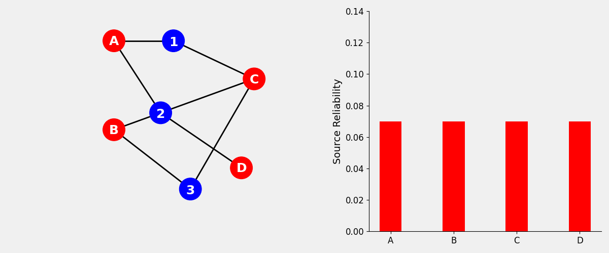

# Verity

## A Structural Framework for Source Reliability Estimation

Verity estimates the reliability of assertions from multiple data sources. It models sources and claims as a bipartite graph to jointly estimate source reliability and claim support.

## Problem

As agentic systems, from foundational large language models (LLMs) to fully autonomous multi-agent workflows, reason and execute complex tasks across digital environments, estimating the reliability of the information they retrieve becomes highly important.

We typically rely on agreement between sources as a signal of reliability. But agreement does not necessarily indicate independent confirmation. Source B may simply repeat information originating from Source A.

## Research Challenge

Source reliability and claim support depend on each other recursively.

A source becomes more reliable when it asserts claims that receive stronger support across the network.
A claim gains support when it is asserted by more reliable sources.

Estimating either quantity requires estimating the other.

## Approach

Sources and claims form a bipartite graph. Each edge represents a source asserting a claim. Verity models information as an interconnected network instead of a collection of independent observations.
<p align="center">
  
</p>

<p align="center">
  <em>An animation of reliability propagation running on a small network of sources and claims. Node size represents estimated reliability, while edges represent assertions.</em>
</p>

Reliability is computed iteratively across the graph. At each iteration, every source distributes its reliability across all claims it asserts. In turn, every claim redistributes the support it has accumulated back to its asserting sources. Iterations repeat until the reliability vector reaches a fixed point. Agreement weighting and dependency adjustment influence how much support each assertion contributes.

## Domain-Agnostic Design

Verity does not interpret a claim's meaning. The current implementation uses product specifications as a development dataset because they provide conflicting information collected from multiple data sources. The same graph structure can represent information from any domain.

The core algorithm receives unique source and claim identifiers together with the assertion edges that form the connections between them. Before evaluation, the submitted assertions are canonicalized and converted into a bipartite graph.

The current research also uses provenance and contextual metadata to estimate source dependencies. This creates a dependency matrix that reduces the influence of assertions that may not be supported by independent sources.

## Repository

- `agent_dataset/` - Multi-agent and enterprise retrieval experiments
- `benchmark/` - Reproducible benchmark dataset used for development
- `reliability/` - Reliability propagation and dependency analysis
- `paper/` - Research paper
- `research/` - Research notes
- `scripts/` - Development utilities

## Getting Started

Clone the repository:

```bash
git clone https://github.com/cole-h06/Verity.git
cd Verity
```

Create a virtual environment and install the dependencies:

```bash
python3 -m venv .venv
source .venv/bin/activate
pip install -r requirements.txt
```

Then explore one of the included experiments:

- [`benchmark/`](benchmark/README.md) - Reproducible benchmark dataset
- [`agent_dataset/`](agent_dataset/README.md) - Multi-agent retrieval workflow
  
## Current Status

Verity is an active research project focused on estimating information reliability based on the graph structure of an information network. The current algorithm has been tested with a [controlled multi-agent dataset](agent_dataset/README.md) and a [simulated enterprise retrieval workflow](agent_dataset/enterprise/README.md).

## MCP Server

Verity will be accessible through an open-source [Model Context Protocol (MCP)](https://modelcontextprotocol.io) server.

This repository contains the research and reference implementation behind the server.

## Vision

Autonomous agents are capable of retrieving enormous amounts of information from multiple data sources at scale, but most systems still lack a native mechanism for estimating the reliability of this information. Most current methods analyze the semantic content of retrieved information. While modern LLMs are effective at reasoning about text and supporting context, their ability to reason about how information is structurally related across sources is limited.

Verity takes a complementary approach by shifting part of the evaluation process from reasoning about what was said to reasoning about how information is connected across sources.

## Contact

Feel free to connect with me whether you have any ideas, questions, feedback, or if you just want to chat about interesting topics! 

Email: colehoke1@gmail.com

LinkedIn:
https://www.linkedin.com/in/cole-hoke-8537002a2/
