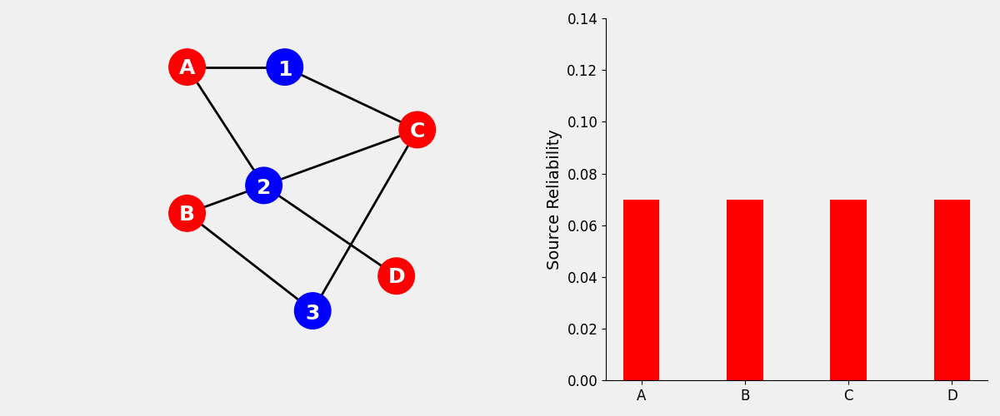

# BRAID: Bipartite Reliability Analysis for Interdependent Data-Sources

## A Structural Approach for Information Reliability Estimation

BRAID is a structural algorithm for estimating the reliability of retrieved information from multiple data sources. It models sources and claims as a bipartite graph to jointly estimate source reliability and claim support, while accounting for dependencies between sources.

## Problem

As agentic systems, from foundational large language models (LLMs) to fully autonomous multi-agent workflows, reason and execute complex tasks across digital environments, estimating the reliability of the information they retrieve becomes highly important.

We typically rely on agreement between sources as a signal of reliability. But agreement does not necessarily mean independent confirmation. Source B may simply repeat information originating from Source A.

## Research Challenge

Source reliability and claim support are recursively dependent on each other.

A source becomes more reliable when it asserts claims that receive stronger support across the network.
A claim gains support when it is asserted by more reliable sources.

Ultimately, estimating either quantity requires estimating the other.

## Approach

Sources and claims form a bipartite graph. Each edge represents a source asserting a claim. BRAID models information as an interconnected network instead of a collection of independent observations.
<p align="center">
  
</p>

<p align="center">
  <em>An animation of reliability propagation running on a small network of sources and claims. Node size represents estimated reliability, while edges represent assertions.</em>
</p>

Reliability is computed iteratively across the graph. At each iteration, every source distributes its reliability across all claims it asserts. In turn, every claim redistributes the support it has accumulated back to its asserting sources. Iterations repeat until the reliability vector reaches a fixed point. Agreement weighting and dependency adjustment influence how much support each assertion contributes.

## Domain-Agnostic Design

BRAID does not interpret a claim's meaning. Frozen structural fixtures in `tests/fixtures/` are the canonical conformance and development data. Synthetic algorithm experiments and applied agent environments provide additional research inputs. The same graph structure can represent information from any domain.

The algorithm receives unique source and claim identifiers, where assertion edges connect the nodes. Before evaluation, the submitted assertions are canonicalized and converted into a bipartite graph.

BRAID estimates source dependencies from recorded provenance and contextual
metadata. Automatic structural-overlap estimation is disabled in BRAID 1.0.0;
agreement alone does not establish copying.

## Algorithm Authority

[BRAID 1.0.0](spec/README.md) defines the current mathematical contract,
reference implementation and BRAID-owned frozen conformance fixtures. Omneum
is a downstream implementation, not an algorithmic authority. See the
[synchronization record](spec/synchronization.md) for migration evidence,
limitations and the protected research-test conflict.

Run independent conformance with:

```bash
python -m pytest tests/test_spec_conformance.py
```

## Repository

- `src/braid/` - BRAID reference implementation (Python imports remain `braid`)
- `spec/` - Normative specification, algorithm manifest and synchronization history
- `tests/` - Repository conformance tests and canonical frozen fixtures
- `experiments/algorithm/` - Direct synthetic BRAID experiments
- `experiments/applied/agent_dataset/` - Agent and enterprise retrieval experiments
- `research/analysis/` - Reusable historical research diagnostics
- `research/figures/` - Research figures and animation
- `scripts/` - Development utilities

The old product-spec CSV benchmark and PostgreSQL execution pathway are retired.
The [reorganization record](research/reorganization.md) lists all moves and deletions.

## Getting Started

Clone the repository:

```bash
git clone https://github.com/cole-h06/braid.git
cd braid
```

Create a virtual environment and install the dependencies:

```bash
python3 -m venv .venv
source .venv/bin/activate
pip install -r requirements.txt
pip install -e .
```

Then explore one of the included experiments:

- [Algorithm experiments](experiments/algorithm/README.md)
- [Agent retrieval workflow](experiments/applied/agent_dataset/README.md)

From the repository root, expose the applied experiment package when running its commands:

```bash
PYTHONPATH=experiments/applied python -m agent_dataset.run
python -m pytest
```

Pytest configures `src/` and `experiments/applied/` automatically. For development
without installing the package, use `PYTHONPATH=src:experiments/applied` for Python commands.

Known failures are preserved: `test_discount` fails its strict-decrease assertion,
and all nine direct algorithm scripts fail because their graph stubs lack explicit
attribute identities. These remain visible; no xfails or skips were added.

## Current Status

BRAID is an active research project focused on developing a method for estimating information reliability through structural analysis of bipartite information networks. The algorithm has been tested with a [controlled multi-agent dataset](experiments/applied/agent_dataset/README.md) and a [simulated enterprise retrieval workflow](experiments/applied/agent_dataset/enterprise/README.md).

## MCP Server

The BRAID algorithm will be exposed through an open-source [Model Context Protocol (MCP)](https://modelcontextprotocol.io) server for agentic systems.

This repository contains the research and reference implementation of BRAID.

## Vision

Autonomous agents are capable of retrieving enormous amounts of information from multiple data sources at scale, but most applications still lack a native mechanism for estimating the reliability of this information. Current methods mainly analyze the semantic content of retrieved information. While modern LLMs are effective at reasoning about text and supporting context, their ability to reason about how information is structurally related across sources is limited.

BRAID takes a complementary approach to semantic reasoning by evaluating the structure of an information network. It shifts part of the evaluation process from reasoning about what was said to reasoning about how information is connected across sources.

## Contact

Feel free to connect with me whether you have any ideas, questions, feedback, or if you just want to chat about interesting topics!

Email: colehoke1@gmail.com

LinkedIn:
https://www.linkedin.com/in/cole-hoke-8537002a2/
