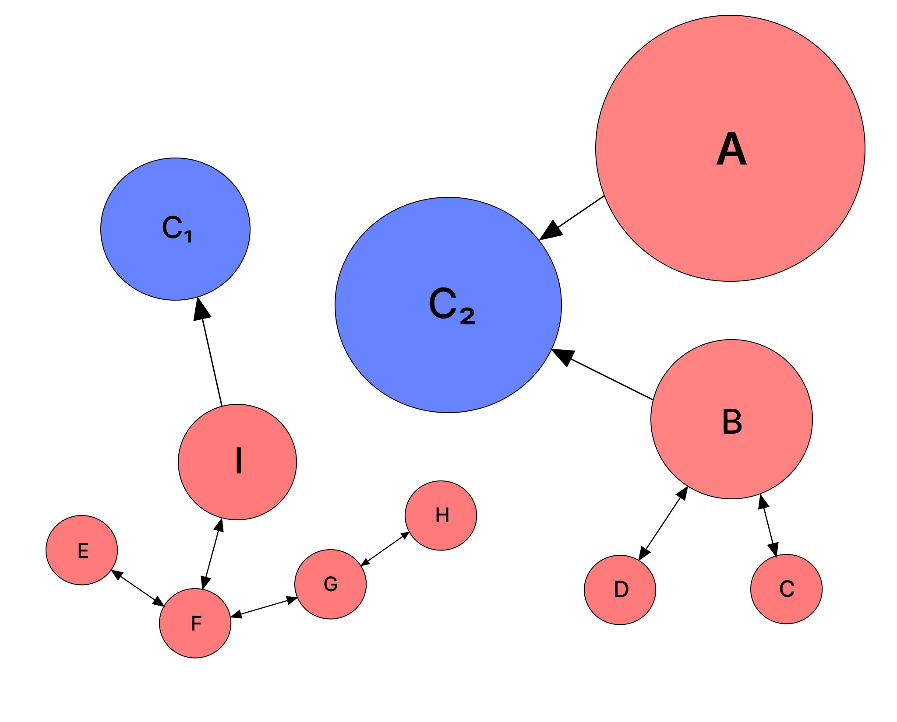

# BRAID

BRAID is an algorithm for measuring the reliability of AI context.

It assigns a numerical reliability score to each source in a set of sources and a support score for each piece of information, such as context assembled for AI systems, with the purpose of estimating how much reliable, independent support that context contains.



*A simplified illustration of the BRAID algorithm, showing sources (red) and claims (blue). Node size represents perceived reliability or support. Directed edges represent source–claim relationships and bidirectional edges represent dependencies between sources.*

## How BRAID Works

BRAID evaluates context by recursively relating the reliability of sources to the support of the information they provide. The underlying assumption is that more reliable sources are likely to provide strongly supported information.

A source is considered more reliable when it contributes information that is itself well supported by reliable sources. Likewise, information in the context receives greater support when it is supported by reliable sources. The amount of support attributed is adjusted based on how independent its sources are.

These relationships are recursive: source reliability influences the support assigned to information in the context, while that support in turn influences source reliability. BRAID repeatedly propagates these scores through the context graph while accounting for dependencies among sources, until the scores converge.

### Context as a Graph

BRAID represents AI context as a bipartite graph where sources and claims are nodes, and edges represent assertions. Each source is connected to the claims it supports through an assertion, while relationships between sources capture potential dependencies in how the sources derived their information.

The graph is defined as:

$$
G = (S, C, E)
$$

where:

- $S$ is the set of sources.
- $C$ is the set of claims.
- $E$ is the set of assertions connecting sources to claims.

## Algorithm

BRAID outputs a normalized score vector used to represent the relative reliability of sources within a given context. Each source is assigned a numerical reliability score, with the scores collectively normalized to sum to 1.

For example, if five sources are initialized with equal reliability, each source receives a score of 0.2. BRAID then repeatedly updates these scores based on the claims supported by each source and the estimated independence of the sources supporting those claims.

BRAID also assigns a support score to each claim. A claim receives greater support when it is supported by sources with higher reliability and when those sources are estimated to be independent of one another.

The algorithm requires several passes, called iterations, through the
context graph. During each iteration, source reliability is propagated to the claims those sources support, and claim support is propagated back to the sources that support those claims. The process continues until the scores converge.

BRAID therefore works on the assumption that a claim supported by reliable and independent sources should receive greater support, while a source that consistently supports well-supported claims should receive greater reliability.

### Simplified Algorithm

Consider a context containing three sources supporting the same claim:

- Source A
- Source B
- Source C

BRAID initially assigns each source an equal reliability score:

$$
s_A = s_B = s_C = \frac{1}{3}
$$

Suppose Source B and Source C are partially dependent because they obtained their information from the same upstream source. Source A is independent of both.

BRAID first propagates each source's reliability to the claim. Because B and C are partially dependent, their contributions are discounted relative to the independent contribution from A.

The resulting claim support is then propagated back to the sources. A source whose contribution helps establish a well-supported claim receives greater reliability in the next iteration.

This process is repeated:

$$
\text{source reliability}
\rightarrow
\text{claim support}
\rightarrow
\text{source reliability}
\rightarrow \cdots
$$

until the scores converge.

This is a simplified illustration of BRAID's recursive propagation process. For the complete mathematical specification of BRAID, see the
[BRAID specification](spec/braid.md).

## Quick Start

Clone the repository:

```bash
git clone https://github.com/cole-h06/braid.git
cd braid
```

Create a virtual environment and install the dependencies:

```bash
python3 -m venv .venv
source .venv/bin/activate
pip install -r requirements.txt
```

Run the included multi-agent example:

```bash
PYTHONPATH=src:experiments/applied python3 -m agent_dataset.run
```

The example runs a controlled workflow in which five specialized agents
produce fifteen assertions.

For the full experiment, see [`agent_dataset/`](agent_dataset/README.md).

## License

BRAID is licensed under the [MIT License](LICENSE).